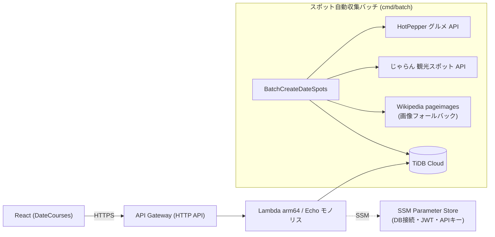

# date-courses-go 🗺️

**「DateCourses」の Go 製バックエンド API。** 実務で経験した PHP→Go リプレイスと同じ発想で、Rails バックエンドの **Go(Echo) リプレイス実装**として開発しています。

> 📦 これは [DateCourses](https://github.com/daisuke-harada/date-course)（モノレポ）のサブモジュールです。
> 同一の OpenAPI 契約に対して Rails 版と Go 版の 2 実装を用意し、フロント（React）を止めずに切り替えられる構成になっています。

## 🎯 見どころ

- **実在スポットの自動収集** — デートスポットを **HotPepper グルメ API / じゃらんnet 観光スポット API** から自動取得するバッチを実装（後述）。
- **フルサーバレス構成** — AWS Lambda(arm64) + API Gateway HTTP API + TiDB Cloud。常時稼働サーバ不要でコストを最小化。
- **OpenAPI First / 型安全** — OpenAPI 定義から型・サーバインターフェース・ハンドラスタブを自動生成。仕様とコードのズレを防ぐ。
- **クリーンアーキテクチャ** — domain / usecase / interface / infrastructure の4層で責務分離。repository は interface＋mockでテスト容易。
- **TDD ＋ CI/CD** — Red→Green→Refactor を徹底。GitHub Actions で build / lint / test、main マージで SAM デプロイ（OIDC 認証）。

---

## 目次

- [アーキテクチャ](#アーキテクチャ)
- [実在スポットの自動収集（HotPepper / じゃらん 連携）](#実在スポットの自動収集hotpepper--じゃらん-連携)
- [技術スタック](#技術スタック)
- [ディレクトリ構成（クリーンアーキテクチャ）](#ディレクトリ構成クリーンアーキテクチャ)
- [CI/CD・IaC（SAM）](#cicdiacsam)
- [ローカル開発](#ローカル開発)
- [コード生成（OpenAPI First）](#コード生成openapi-first)

---

## アーキテクチャ

Echo を採用し、**ローカル開発（`go run`）と Lambda 本番で同一コードベース**を使い回します（`aws-lambda-go-api-proxy` 経由）。



**なぜ Lambda か**: ① コスト削減（リクエストがない時間帯は費用ゼロ）② Go × SAM × Lambda の実践習得。
DB は TiDB Cloud（外部エンドポイント）で VPC 不要。シークレットは SSM Parameter Store 管理で、テンプレートにハードコードしません。

---

## 実在スポットの自動収集（HotPepper / じゃらん 連携）

デートスポットは **AI生成の架空データや高価な Google Places API（1バッチ ~$230）を使わず**、実在スポットを**無償の外部 API から自動収集**します。データソースはジャンルに応じて使い分けます（いずれもリクルート Web サービス。`RECRUIT_API_KEY` を共用）。

| データソース | 用途（ジャンル） | 対象ジャンルID | 形式 |
|---|---|---|---|
| **HotPepper グルメ API** | 飲食系（カフェ・寿司・居酒屋・焼肉 等） | 2, 3, 7, 8, 9 | JSON |
| **じゃらんnet 観光スポット API** | 観光・レジャー系（ショッピング・アウトドア・テーマパーク・公園 等） | 1, 4, 5, 6, 10, 11, 12 | XML |

### 設計上の工夫（面接で語れるポイント）

- **ジャンルでデータソースを自動振り分け** — `SpotFetcher` がジャンルIDを見て HotPepper / じゃらん を選択（`internal/infrastructure/external/spot_fetcher.go`）。
- **画像フォールバック** — 外部APIに画像が無いスポットは **Wikipedia pageimages API（無償・キー不要）** で補完。
- **重複登録の防止** — スポット名を `NormalizeName`（NFKC正規化・空白除去・小文字化）した `normalized_name` を保持し、**都道府県 × 正規化名**でユニーク判定。
- **冪等なバッチ設計** — 都道府県×ジャンルの既存数がしきい値以上ならスキップ。再実行しても重複・無駄な書き込みが起きない。
- **持たない設計** — 営業時間など「機械的に自動更新できない情報」は、陳腐化を避けるためあえてスキーマに持たせない。

### バッチ処理フロー（`internal/usecase/batch_create_date_spots.go`）

1. 都道府県 × ジャンルの既存スポット数を数え、しきい値（`minExistingSpots`）以上ならスキップ
2. `SpotFetcher.FetchSpots` でジャンルに対応する外部 API からスポット候補を取得（画像が無ければ Wikimedia 補完）
3. 正規化名で重複チェックし、新規分のみ `CreateBatch` でまとめて登録

### スポットの出自管理（`date_spots.source`）

| 値 | 意味 | `maps_url` の中身 |
|---|---|---|
| `hotpepper` | HotPepper 由来 | HotPepper 店舗ページ URL |
| `jalan` | じゃらん 由来 | じゃらん スポットページ URL |
| `manual` | 手動登録 | Google Maps 検索 URL（`BuildMapsURL` フォールバック） |

---

## 技術スタック

| 領域 | 技術 |
|---|---|
| 言語 / FW | Go / Echo v4 |
| DB / ORM | TiDB Cloud（本番）/ MySQL（ローカル）/ GORM |
| API設計 | OpenAPI（`oapi-codegen` で型・サーバ生成）/ JWT 認証 |
| 外部API | HotPepper グルメ / じゃらんnet / Wikipedia pageimages（＋Gemini・Google Places・Nominatim クライアント） |
| インフラ / IaC | AWS Lambda(arm64) / API Gateway HTTP API / SAM / SSM Parameter Store |
| CI/CD | GitHub Actions（build / lint / test / SAM deploy・OIDC） |
| テスト | `go test` / `go.uber.org/mock`（TDD） |
| スキーマ管理 | sqldef（mysqldef） |

---

## ディレクトリ構成（クリーンアーキテクチャ）

```
cmd/
  api/              ローカル開発用サーバ (go run)
  batch/            スポット自動収集バッチ
  lambda/monolith/  Lambda 用エントリポイント（全ルートをまとめたモノリス）
internal/
  domain/           model（GORMタグ付きstruct）/ repository・service interface
  usecase/          ビジネスロジック・バリデーション（openapi非依存）
  interface/        handler（Echo）/ openapi（生成物＋変換）
  infrastructure/   persistence（GORM実装）/ external（外部APIクライアント群）/ db
api/                OpenAPI 定義（paths / components を $ref で分割）
template.yaml       AWS SAM テンプレート（Lambda + HTTP API の IaC）
```

層の依存方向は `interface → usecase → domain`、`infrastructure → domain` で、usecase は openapi パッケージに依存しません（handler 層で変換）。

---

## CI/CD・IaC（SAM）

### CI（`.github/workflows/ci.yaml`）
PR をトリガーに **Build（`go build ./...`）/ Lint（`golangci-lint`）/ Test（`go test ./...`）** を実行。同一PRへの連続プッシュは `concurrency` で前ジョブをキャンセル。

### CD（`.github/workflows/cd.yaml`）
`main` への push をトリガーに AWS へデプロイ。**GitHub Actions OIDC** で一時認証（AWS 認証情報をシークレットに保存しない最小権限設計）→ `make sam-build`（arm64 クロスコンパイル＋`sam build`）→ `sam deploy`。

> ℹ️ 現在はコスト/運用都合で CD を一時停止（`Deployment is disabled`）。再開はワークフローのコメントアウトを戻すだけ。

### SAM テンプレート（`template.yaml`）
| リソース | 種別 | 説明 |
|---|---|---|
| `DateCoursesFunction` | `AWS::Serverless::Function` | arm64 / provided.al2023 のモノリス Lambda |
| `DateCoursesHttpApi` | `AWS::Serverless::HttpApi` | API Gateway HTTP API（CORS 設定済み） |
| `LambdaExecutionRole` | `AWS::IAM::Role` | 実行ロール（CloudWatch Logs のみ許可） |

環境変数はすべて SSM Parameter Store 参照で注入。

---

## ローカル開発

```bash
# 前提: Docker / docker-compose, Go ツールチェイン

docker compose up -d        # DB コンテナ起動
make apply-schema           # スキーマ適用（sqldef）
make db-seed                # シード投入
make run                    # サーバ起動（go run ./cmd/api/main.go）
```

必要な環境変数（direnv 推奨）:

```bash
export DB_USER=dev DB_PASSWORD=secret DB_HOST=127.0.0.1 DB_PORT=3306 DB_NAME=date_courses_dev
export JWT_SECRET_KEY=your-secret
export GOOGLE_MAPS_API_KEY=your-key
export RECRUIT_API_KEY=your-key   # HotPepper / じゃらん 連携用
```

### Lambda をローカルで動かす

```bash
make sam-build      # arm64 ビルド + sam build
make local-lambda   # sam local start-api（ポート3000）
```

---

## コード生成（OpenAPI First）

API の request / response を変えるときは **まず OpenAPI（`api/`）を編集 → `make gen` → 実装** の順を厳守（生成物は直接編集しない）。

```bash
make gen   # openapi-generate（定義結合）+ go-generate（型/サーバ/モック/ハンドラ生成）
```

| 生成対象 | 出力 |
|---|---|
| 型 / Echo サーバ interface | `internal/interface/openapi/api_types.gen.go` / `api_server.gen.go` |
| ハンドラスタブ | `internal/interface/handler/`（既存はスキップ） |
| テスト用モック | `internal/{domain/repository,domain/service,usecase}/mock/` |
